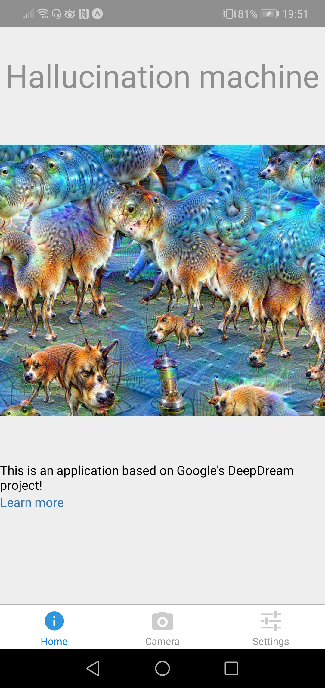
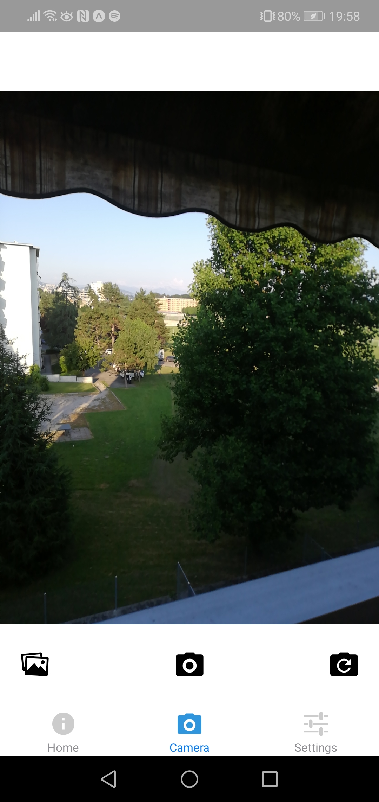

## Hallucination Machine  

Hallucination Machine is the mobile application based on Google's [DeepDream](https://github.com/google/deepdream) project. The goal of this app is to let the user upload the image to the application and get the "hallucinated" version of the image.  

### The UI  
The UI is composed of 3 main tabs:
 * `Home` tab containing the description of the application  
 * `Camera` tab for taking pictures or uploading them from the camera roll  
 * `Settings` tab to customise the image generated by the application  

For the moment, only `Home` and `Camera` tabs are implemented as shown below:  

| Home     | Camera     |
| :-------------: | :-------------: |
|        |        |  

In the `Camera` tab, the user can take a picture by clicking the middle _Camera_ icon or upload a picture from the camera roll by clicking the _Gallery_ icon on the left. The _Flip_ icon on the right lets the user flip the camera between the front and the back ones.  

Once the image is chosen, the following screen appears:  

  

To launch the "hallucination" process, the user has to click the _Dream_ button.  
By now, the server is only able to upload the selected image.

### Next steps   

- [ ] Integrate the DeepDream code to the backend and launch it when the _Dream_ button is pressed, then render the result to the UI  
- [ ] `Settings` tab: create a screen letting the user customise the image rendered by the application. The user will be able to choose filters, layers and the feature channels maximised by the DeepDream algorithm.  
- [ ] Update the `Home` tab: project description, user guide.  
- [ ] Improve the style of the application  
- [ ] Bug fixes

### Run the app  

Requirements:
* python 3.6
* [conda](https://docs.conda.io/projects/conda/en/latest/user-guide/install/) package & environment manager (or other environment manager)  
* npm verion: 6.9.2

__Backend__  

In the `HallicinationMachine/backend` folder:  

1. Create and activate the environment to launch the server    
```
> conda create -n hallucination-machine python=3.6  
> conda activate hallucination-machine
```  

2. Install the packages:
```
> pip install -r requirements.txt
```  

3. Launch the server  
```
> python server.py
```  

You should see something like this on the terminal window:  


__Frontend__  
1. Install the [Expo CLI](https://expo.io/)  
```
> npm install -g expo-cli
```  

2. Install the [Expo client app](https://play.google.com/store/apps/details?id=host.exp.exponent&hl=en)  
`NOTE`: the application has only been tested on the Android device, so it might not work on iOS.

3. Switch to `HallucinationMachine/frontend/HallucinationMachine` folder and add `.env` file to the root of the project. In this file, write:  
```
SERVER_URL='http://serveraddr:5000'
```
where `serveraddr` is the ip address of the machine on which the server runs.  
4. From the `HallucinationMachine/frontend/HallucinationMachine` folder, execute the following commands:  
```
> npm install  
> npm start
```  
This will launch the Metro Bundler in your browser. To load the application on the mobile device, open the expo app and scan the QR code provided in your terminal or on the browser page.  
